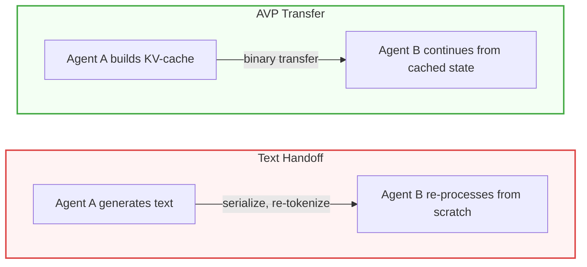

# AVP — Agents Share Thoughts, Not Text

[](https://pypi.org/project/avp/)
[](https://github.com/VectorArc/avp-python/actions/workflows/ci.yml)
[](LICENSE)
[](https://python.org)
[](https://github.com/VectorArc/avp-spec)

When LLM agents hand off work as text, the next agent re-processes everything from scratch. AVP transfers the actual computation — KV-cache, hidden states, attention — so the receiving agent picks up where the sender left off. 46-78% fewer tokens, 2-4x faster. Sometimes more accurate than text. Built on [LatentMAS](https://arxiv.org/abs/2511.20639).

```bash
pip install avp
```

> **Requires self-hosted models on GPUs.** AVP accesses model internals (KV-cache, hidden states) that cloud APIs don't expose. If you call OpenAI, Anthropic, or Google endpoints, AVP can't help. Good fit: multi-agent pipelines on HuggingFace Transformers with local or datacenter GPUs.

## Quick Start

```python
from avp import HuggingFaceConnector

connector = HuggingFaceConnector.from_pretrained("Qwen/Qwen2.5-7B-Instruct")
prompt = "Analyze this math problem: 24 * 17 + 3"

# Agent A thinks (builds KV-cache, no text output)
context = connector.think(prompt, steps=10)

# Agent B generates with Agent A's context
answer = connector.generate(prompt, context=context)
```

## Results

| | Direct | Latent (AVP) | Text Chain |
|---|--------|--------------|------------|
| **HumanEval** (Qwen 7B, n=164) | 58.5% | **67.1%** | 53.0% |
| **GSM8K** (Qwen 7B, n=200) | 91.0% | **90.5%** | 87.0% |
| **DebugBench** (Qwen 7B, n=100) | 50.0% | **51.0%** | 49.0% |
| **GSM8K** (Llama 3B, n=200) | 75.0% | **78.0%** | 75.5% |

+14.1pp on code generation vs text (p=0.029). DebugBench is neutral across all modes, but you still save 47% of tokens and run 3x faster. All runs on NVIDIA A100.

**Cross-model (zero training, 6 KB on the wire):**

| Source | Target | GSM8K | HumanEval |
|--------|--------|-------|-----------|
| Qwen 7B | Llama 3B | 74.5% | 47.0% |
| Llama 3B | Qwen 7B | **90.0%** | **79.3%** |

A small 3B model sharing its reasoning lifts a 7B solver to 90% on math and 79.3% on code. The projection is vocabulary-mediated — no learned parameters, no training data, works across model families.

Full results: **[Benchmarks](docs/BENCHMARKS.md)** — 8 benchmarks, 5 models, 2 families, reproducible.

## How It Works



Three modes, auto-negotiated via handshake:

| Mode | When | Payload |
|------|------|---------|
| **Latent** | Same model | Full KV-cache |
| **Cross-model** | Different model or family | Single projected hidden state (~6 KB) |
| **JSON fallback** | No compatible projection path | Plain text |

## Works With

Replace `llm.invoke()` with `avp.generate()`. Your framework sees text in, text out.

| Framework | Integration point |
|-----------|-------------------|
| **LangGraph** | Graph node replaces LLM call |
| **CrewAI** | `BaseLLM.call()` override |
| **PydanticAI** | `FunctionModel` callback |
| **LlamaIndex** | `CustomLLM.complete()` override |
| **A2A / MCP** | Complementary — AVP handles tensor transfer, they handle routing |
| **HuggingFace** | Full latent pipeline (KV-cache + hidden states) |

See **[Framework Integration Guide](docs/FRAMEWORK_INTEGRATION.md)** for working examples.

<details>
<summary><strong>Cross-model transfer</strong></summary>

```python
from avp import HuggingFaceConnector

researcher = HuggingFaceConnector.from_pretrained("Qwen/Qwen2.5-7B-Instruct")
solver = HuggingFaceConnector.from_pretrained("meta-llama/Llama-3.2-3B-Instruct")

prompt = "Solve step by step: 24 * 17 + 3"
context = researcher.think(prompt, steps=10)
answer = solver.generate(prompt, context=context, source=researcher)
```

Calibration is automatic and one-time per model pair (~0.5-2s), cached to `~/.avp/maps/`.

</details>

<details>
<summary><strong>Easy API (one-liners)</strong></summary>

```python
import avp

# think + generate in one call
answer = avp.generate("Solve: 24 * 17 + 3", model="Qwen/Qwen2.5-7B-Instruct")

# cross-model
answer = avp.generate("Solve: 24 * 17 + 3",
                       model="meta-llama/Llama-3.2-3B-Instruct",
                       source_model="Qwen/Qwen2.5-7B-Instruct")
```

</details>

<details>
<summary><strong>vLLM</strong></summary>

**Latent transfer is not supported on vLLM yet.** The latent pipeline (`think()`/`generate()` with context) requires HuggingFace Transformers. `VLLMConnector` exists for text-only generation and model identity — it will error if you pass latent context. vLLM latent support is on the roadmap.

</details>

<details>
<summary><strong>Cross-process transfer</strong></summary>

```python
# Process A: serialize
wire_bytes = context.to_bytes(session_id="s1", source_agent_id="agent-a")

# Process B: restore and generate
from avp import AVPContext, HuggingFaceConnector
connector = HuggingFaceConnector.from_pretrained("Qwen/Qwen2.5-7B-Instruct")
restored = AVPContext.from_bytes(wire_bytes, device="cuda")
answer = connector.generate(prompt, context=restored)
```

</details>

## Roadmap

- vLLM latent transfer
- Bidirectional latent communication (both agents share thinking, not just one)
- CacheGen-style KV-cache compression (3-4x reduction)

## Documentation

- **[AVP Specification](https://github.com/VectorArc/avp-spec)** — Binary format, handshake, transport
- **[Benchmarks](docs/BENCHMARKS.md)** — 8 benchmarks, 5 models, 2 families
- **[Framework Integration](docs/FRAMEWORK_INTEGRATION.md)** — LangGraph, CrewAI, PydanticAI, LlamaIndex
- **[Examples](examples/)** — Quickstart, cross-model, and agent demos
- **[CHANGELOG](CHANGELOG.md)**

## License

Apache 2.0 — see [LICENSE](LICENSE)
