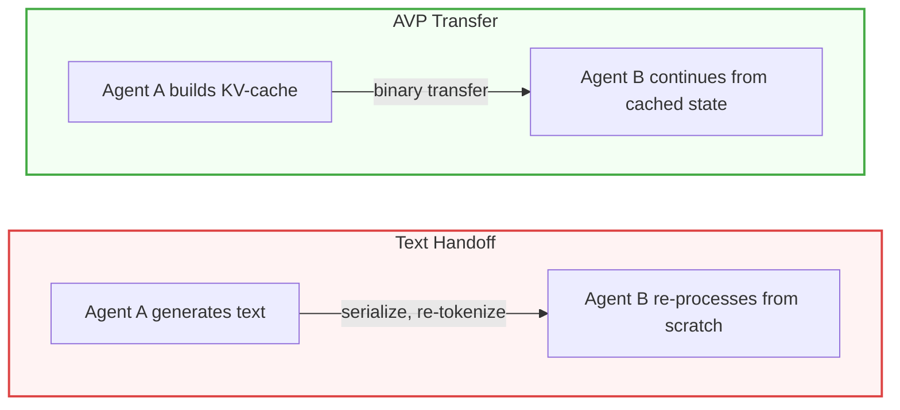

# AVP – Agents Share Thoughts, Not Text

[](https://pypi.org/project/avp/)
[](https://github.com/VectorArc/avp-python/actions/workflows/ci.yml)
[](LICENSE)
[](https://python.org)
[](https://github.com/VectorArc/avp-spec)
[](https://colab.research.google.com/github/VectorArc/avp-python/blob/main/notebooks/avp_quick_start.ipynb)

When LLM agents hand off work as text, the next agent re-processes everything from scratch. AVP (Agent Vector Protocol) transfers the actual computation (KV-cache, hidden states, attention) so the receiving agent picks up where the sender left off. Zero tokens between agents, 2-3x faster pipelines, same or better accuracy. Built on [LatentMAS](https://arxiv.org/abs/2511.20639), extended with cross-model vocabulary-mediated projection. Zero training, works across model families.

> **Requires self-hosted models on GPUs.** AVP accesses model internals (KV-cache, hidden states) that cloud APIs don't expose. If you call OpenAI, Anthropic, or Google endpoints, AVP can't help. Good fit: multi-agent pipelines with local or datacenter GPUs.

## Install

```bash
pip install avp                # Wire format only, no torch            ~25 MB
pip install avp[ollama]        # Local GGUF models via Ollama          ~85 MB
pip install avp[llamacpp]      # Local GGUF models via llama.cpp       ~85 MB
pip install avp[hf]            # HuggingFace Transformers             ~625 MB
pip install avp[vllm]          # vLLM production serving               ~2 GB
pip install avp[langchain]     # LangChain + HF                      ~700 MB
pip install avp[crewai]        # CrewAI + HF                         ~800 MB
pip install avp[autogen]       # AutoGen + HF                        ~700 MB
pip install avp[all]           # Everything except vLLM              ~750 MB
```

## Quick Start

```python
from avp import HuggingFaceConnector

connector = HuggingFaceConnector.from_pretrained("Qwen/Qwen2.5-7B-Instruct")

# Agent A thinks (builds KV-cache, no text output)
context = connector.think("Analyze this math problem: 24 * 17 + 3", steps=20)

# Agent B generates using Agent A's KV-cache
answer = connector.generate("Solve step by step: 24 * 17 + 3", context=context)
```

## Results

**Direct** = single model, no pipeline. **Latent** = AVP transfer. **Text Chain** = standard text handoff between agents.

| | Direct | Latent (AVP) | Text Chain |
|---|--------|--------------|------------|
| **HumanEval** (Qwen 7B, n=164) | 58.5% | **67.1%** | 53.0% |
| **GSM8K** (Qwen 7B, n=200) | 91.0% | 90.5% | 87.0% |
| **DebugBench** (Qwen 7B, n=100) | 50.0% | 51.0% | 49.0% |
| **GSM8K** (Llama 3B, n=200) | 74.5% | 76.0% | 79.0% |

HumanEval: +12.4pp vs text across 4 seeds (p=0.004). GSM8K and DebugBench: neutral across all modes, but the pipeline runs 3x faster (7.6s vs 22.8s end-to-end on DebugBench). Llama 3B: text wins on GSM8K; latent overhead has more impact on smaller models. All benchmarks used `steps=20` on NVIDIA A100.

**Trade-off:** 20 latent steps cost ~0.9s on A100. If Agent A would normally generate 22+ tokens of text, latent is faster.

**Cross-model (zero training):**

| Source -> Target | GSM8K (Rosetta / Text) | HumanEval (Rosetta / Text) |
|-----------------|------------------------|----------------------------|
| Qwen 7B -> Qwen 3B | 82.5% / **88.5%** | **66.5%** / 62.2% |
| Qwen 7B -> Llama 3B | 77.0% / **86.5%** | 47.0% / **57.9%** |
| Llama 3B -> Qwen 7B | **90.0%** / 82.0% | **79.3%** / 61.6% |

Target solo baselines: Qwen 3B = 82.5% / 61.0%, Llama 3B = 76.0% / 50.6%, Qwen 7B = 91.0% / 58.5%.

Rosetta beats text on code generation (HumanEval) in both directions. On math (GSM8K), text wins when the weaker model solves, rosetta wins when the stronger model solves. Vocabulary-mediated projection with zero learned parameters, works across model families.

Full results: **[Benchmarks](docs/BENCHMARKS.md)** – 7 benchmarks, 5 models, 2 families, reproducible.

## How It Works



Three modes, auto-negotiated via handshake:

| Mode | When | Payload |
|------|------|---------|
| **Latent** | Same model | Full KV-cache |
| **Cross-model** | Different model or family | Single projected hidden state (~6 KB) |
| **JSON fallback** | No compatible projection path | Plain text |

## Works With

### Engines

| Engine | Latent think/generate | Cross-model | Install |
|--------|----------------------|-------------|---------|
| **HuggingFace** | Full pipeline | Yes | `avp[hf]` |
| **llama.cpp** | Full pipeline (GGUF) | Yes | `avp[llamacpp]` |
| **Ollama** | Full pipeline (auto-resolves GGUF) | Yes | `avp[ollama]` |
| **vLLM** | Via engine plugin (KV connector + model plugin) | Yes | `avp[vllm]` |

### Frameworks

| Framework | Integration | Install |
|-----------|-------------|---------|
| **LangChain** | `ChatAVP` BaseChatModel | `avp[langchain]` |
| **CrewAI** | `AVPLLM` BaseLLM | `avp[crewai]` |
| **AutoGen** | `AVPChatCompletionClient` | `avp[autogen]` |
| **A2A / MCP** | Complementary: AVP handles tensor transfer, they handle routing | – |

## Engine & Framework Examples

<details>
<summary><strong>HuggingFace</strong> – <code>pip install avp[hf]</code></summary>

```python
from avp import HuggingFaceConnector

connector = HuggingFaceConnector.from_pretrained("Qwen/Qwen2.5-7B-Instruct")

# Agent A thinks (latent forward passes, builds KV-cache)
context = connector.think("Analyze this math problem: 24 * 17 + 3", steps=20)

# Agent B generates from Agent A's computation
answer = connector.generate("Solve step by step: 24 * 17 + 3", context=context)
```

Cross-model:

```python
researcher = HuggingFaceConnector.from_pretrained("Qwen/Qwen2.5-7B-Instruct")
solver = HuggingFaceConnector.from_pretrained("meta-llama/Llama-3.2-3B-Instruct")

context = researcher.think("Analyze this problem", steps=20)
answer = solver.generate("Solve it", context=context, source=researcher, cross_model=True)
```

Calibration is automatic and one-time per model pair (~0.5-2s), cached to `~/.avp/maps/`.

</details>

<details>
<summary><strong>Ollama</strong> – <code>pip install avp[ollama]</code></summary>

```python
from avp.connectors.ollama import OllamaConnector

# Uses Ollama's downloaded GGUF files, auto-unloads from Ollama to free VRAM
connector = OllamaConnector.from_ollama("qwen2.5:7b")
context = connector.think("Analyze this problem", steps=10)
answer = connector.generate("Solve step by step", context=context)
```

Cross-model:

```python
researcher = OllamaConnector.from_ollama("qwen2.5:7b")
solver = OllamaConnector.from_ollama("llama3.2:3b")
context = researcher.think("Analyze this", steps=10)
answer = solver.generate("Solve it", context=context, source=researcher, cross_model=True)
```

Any model you've pulled with `ollama pull` works. AVP resolves the model name to the GGUF blob on disk.

</details>

<details>
<summary><strong>llama.cpp</strong> – <code>pip install avp[llamacpp]</code></summary>

```python
from avp.connectors.llamacpp import LlamaCppConnector

connector = LlamaCppConnector.from_pretrained("Qwen2.5-7B-Instruct-Q4_K_M.gguf")
context = connector.think("Analyze this problem", steps=10)
answer = connector.generate("Solve step by step", context=context)
```

Cross-model:

```python
researcher = LlamaCppConnector.from_pretrained("qwen2-7b.gguf")
solver = LlamaCppConnector.from_pretrained("llama3-3b.gguf")
context = researcher.think("Analyze this", steps=10)
answer = solver.generate("Solve it", context=context, source=researcher, cross_model=True)
```

Runs on CPU or GPU. Uses llama.cpp's embeddings API for hidden state extraction. No forks or custom builds required.

</details>

<details>
<summary><strong>vLLM</strong> – <code>pip install avp[vllm]</code></summary>

vLLM integration uses two engine plugins: a KV connector for cache transfer and a model plugin for latent thinking steps during prefill. Supports Qwen2, Llama, Mistral, and Gemma architectures.

```python
from vllm import LLM, SamplingParams

# Activate AVP latent model wrapper via hf_overrides
engine = LLM(
    model="Qwen/Qwen2.5-7B-Instruct",
    hf_overrides={"architectures": ["AVPLatentQwen2ForCausalLM"]},
    kv_connector="avp.connectors.vllm_kv_connector.AVPKVConnectorV1Dynamic",
    kv_role="kv_both",
    enable_prompt_embeds=True,
)

# Agent A: think (latent steps build KV-cache, saved to file store)
engine.generate("Analyze this problem: 24 * 17 + 3", SamplingParams(max_tokens=1))

# Agent B: generate from Agent A's cached computation
output = engine.generate("Solve step by step: 24 * 17 + 3", SamplingParams(max_tokens=256))
```

The KV connector auto-discovers cached state by prompt hash. Cross-model rosetta is supported via `AVP_ROSETTA_TARGET` environment variable. See `src/avp/connectors/vllm_model_plugin.py` for architecture-specific setup.

</details>

<details>
<summary><strong>LangChain</strong> – <code>pip install avp[langchain]</code></summary>

```python
from avp.integrations.langchain import ChatAVP
import avp

store = avp.ContextStore(default_ttl=300)

# Researcher thinks, solver generates (linked via store key)
researcher = ChatAVP(model="Qwen/Qwen2.5-7B-Instruct", role="think",
                     store=store, store_key="task-1")
solver = ChatAVP(model="Qwen/Qwen2.5-7B-Instruct", role="generate",
                 store=store, store_key="task-1")

# In a LangGraph workflow:
researcher.invoke("Analyze this math problem: 24 * 17 + 3")
answer = solver.invoke("Solve step by step: 24 * 17 + 3")
```

Cross-model:

```python
researcher = ChatAVP(model="Qwen/Qwen2.5-7B-Instruct", role="think",
                     store=store, store_key="task-1")
solver = ChatAVP(model="Qwen/Qwen2.5-1.5B-Instruct", role="generate",
                 source_model="Qwen/Qwen2.5-7B-Instruct",
                 cross_model=True, store=store, store_key="task-1")
```

</details>

<details>
<summary><strong>CrewAI</strong> – <code>pip install avp[crewai]</code></summary>

```python
from avp.integrations.crewai import AVPLLM
from crewai import Agent, Task, Crew
import avp

store = avp.ContextStore(default_ttl=300)

researcher = Agent(
    role="Researcher",
    goal="Analyze math problems",
    llm=AVPLLM(model="Qwen/Qwen2.5-7B-Instruct", role="think",
               store=store, store_key="task-1"),
)
solver = Agent(
    role="Solver",
    goal="Solve math problems step by step",
    llm=AVPLLM(model="Qwen/Qwen2.5-7B-Instruct", role="generate",
               store=store, store_key="task-1"),
)
```

</details>

<details>
<summary><strong>AutoGen</strong> – <code>pip install avp[autogen]</code></summary>

```python
from avp.integrations.autogen import AVPChatCompletionClient
from autogen_agentchat.agents import AssistantAgent
import avp

store = avp.ContextStore(default_ttl=300)

researcher = AssistantAgent(
    "researcher",
    model_client=AVPChatCompletionClient(
        model="Qwen/Qwen2.5-7B-Instruct", role="think",
        store=store, store_key="task-1",
    ),
)
solver = AssistantAgent(
    "solver",
    model_client=AVPChatCompletionClient(
        model="Qwen/Qwen2.5-7B-Instruct", role="generate",
        store=store, store_key="task-1",
    ),
)
```

</details>

<details>
<summary><strong>Easy API (one-liners)</strong></summary>

```python
import avp

# think + generate in one call
answer = avp.generate("Solve: 24 * 17 + 3", model="Qwen/Qwen2.5-7B-Instruct")

# cross-model (experimental)
answer = avp.generate("Solve: 24 * 17 + 3",
                       model="meta-llama/Llama-3.2-3B-Instruct",
                       source_model="Qwen/Qwen2.5-7B-Instruct",
                       cross_model=True)
```

</details>

<details>
<summary><strong>Cross-process transfer</strong></summary>

```python
# Process A: serialize
wire_bytes = context.to_bytes(session_id="s1", source_agent_id="agent-a")

# Process B: restore and generate
from avp import AVPContext, HuggingFaceConnector
connector = HuggingFaceConnector.from_pretrained("Qwen/Qwen2.5-7B-Instruct")
restored = AVPContext.from_bytes(wire_bytes, device="cuda")
answer = connector.generate(prompt, context=restored)
```

</details>

## Roadmap

- Bidirectional latent communication (both agents share thinking, not just one)
- CacheGen-style KV-cache compression (3-4x reduction)

## Documentation

- **[AVP Specification](https://github.com/VectorArc/avp-spec)** – binary format, handshake, transport
- **[Benchmarks](docs/BENCHMARKS.md)** – 7 benchmarks, 5 models, 2 families
- **[Framework Integration](docs/FRAMEWORK_INTEGRATION.md)** – LangChain, CrewAI, AutoGen
- **[Examples](examples/)** – quickstart, cross-model, and agent demos
- **[CHANGELOG](CHANGELOG.md)**

## License

Apache 2.0 – see [LICENSE](LICENSE)
