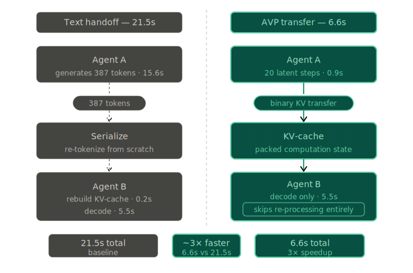

# AVP – Agents Share Thoughts, Not Text

[](https://pypi.org/project/avp/)
[](https://github.com/VectorArc/avp-python/actions/workflows/ci.yml)
[](LICENSE)
[](https://python.org)
[](https://github.com/VectorArc/avp-spec)
[](https://colab.research.google.com/github/VectorArc/avp-python/blob/main/notebooks/avp_quick_start.ipynb)

When LLM agents hand off work as text, the next agent re-processes everything from scratch. AVP (Agent Vector Protocol) transfers the actual computation (KV-cache, hidden states, attention) so the receiving agent picks up where the sender left off. Zero tokens between agents, 2-3x faster pipelines, same or better accuracy. Built on [LatentMAS](https://arxiv.org/abs/2511.20639), extended with cross-model vocabulary-mediated projection. Zero training, works across model families.

```bash
pip install avp[hf]
```

> **Requires self-hosted models on GPUs.** AVP accesses model internals (KV-cache, hidden states) that cloud APIs don't expose. Other engines: `avp[ollama]`, `avp[llamacpp]`, `avp[vllm]` – see [Works With](#works-with).

## Quick Start

**Same model** – two agents share a KV-cache:

```python
from avp import HuggingFaceConnector

connector = HuggingFaceConnector.from_pretrained("Qwen/Qwen2.5-7B-Instruct")

# Agent A thinks (builds KV-cache, no text output)
context = connector.think("Analyze this math problem: 24 * 17 + 3", steps=20)

# Agent B generates using Agent A's KV-cache
answer = connector.generate("Solve step by step: 24 * 17 + 3", context=context)
```

**Cross-model** – different architectures, zero training:

```python
researcher = HuggingFaceConnector.from_pretrained("Qwen/Qwen2.5-7B-Instruct")
solver = HuggingFaceConnector.from_pretrained("meta-llama/Llama-3.2-3B-Instruct")

context = researcher.think("Analyze this problem", steps=20)
answer = solver.generate("Solve it", context=context, source=researcher, cross_model=True)
```

**Cross-process** – serialize context over any transport:

```python
# Process A
wire_bytes = context.to_bytes(session_id="s1", source_agent_id="agent-a")

# Process B
restored = AVPContext.from_bytes(wire_bytes, device="cuda")
answer = connector.generate(prompt, context=restored)
```

You don't choose the transfer mode. The handshake auto-negotiates based on model compatibility: same model → full KV-cache, different models → vocabulary-mediated projection (~6 KB), incompatible models → JSON text fallback.

## Results

**Direct** = single model, no pipeline. **Latent** = AVP transfer. **Text Chain** = standard text handoff between agents.

| | Direct | Latent (AVP) | Text Chain |
|---|--------|--------------|------------|
| **HumanEval** (Qwen 7B, n=164) | 58.5% | **67.1%** | 53.0% |
| **GSM8K** (Qwen 7B, n=200) | 91.0% | 90.5% | 87.0% |
| **DebugBench** (Qwen 7B, n=100) | 50.0% | 51.0% | 49.0% |
| **GSM8K** (Llama 3B, n=200) | 74.5% | 76.0% | 79.0% |

HumanEval: +12.4pp vs text across 4 seeds (p=0.004). GSM8K and DebugBench: neutral across all modes, but the pipeline runs 3x faster (7.6s vs 22.8s end-to-end on DebugBench). Llama 3B: text wins on GSM8K; latent overhead has more impact on smaller models. All benchmarks used `steps=20` on NVIDIA A100.

**Trade-off:** 20 latent steps cost ~0.9s on A100. If Agent A would normally generate 22+ tokens of text, latent is faster.

**Cross-model (zero training):**

| Source → Target | GSM8K (Rosetta / Text) | HumanEval (Rosetta / Text) |
|-----------------|------------------------|----------------------------|
| Qwen 7B → Qwen 3B | 82.5% / **88.5%** | **66.5%** / 62.2% |
| Qwen 7B → Llama 3B | 77.0% / **86.5%** | 47.0% / **57.9%** |
| Llama 3B → Qwen 7B | **90.0%** / 82.0% | **79.3%** / 61.6% |

Target solo baselines: Qwen 3B = 82.5% / 61.0%, Llama 3B = 76.0% / 50.6%, Qwen 7B = 91.0% / 58.5%.

Full results: **[Benchmarks](docs/BENCHMARKS.md)** – 7 benchmarks, 5 models, 2 families, reproducible.

## How It Works



AVP auto-negotiates the transfer mode via a handshake at connection time. You write the same `think()` / `generate()` code regardless of which mode is selected:

| Mode | When | What transfers | Size |
|------|------|----------------|------|
| **Latent** | Same model | Full KV-cache | ~390 MB for 7B |
| **Cross-model** | Different model or family | Projected hidden state via shared vocabulary | ~6 KB |
| **JSON fallback** | No compatible projection path | Plain text | Varies |

The handshake checks model hash → structural match → shared tokenizer → vocabulary overlap (≥100 BPE tokens) → JSON. You never configure this manually.

## Works With

### Engines

| Engine | Latent Pipeline | Cross-model |
|--------|----------------|-------------|
| **[HuggingFace](docs/FRAMEWORK_INTEGRATION.md)** `avp[hf]` | Full think/generate | Yes |
| **[Ollama](docs/FRAMEWORK_INTEGRATION.md)** `avp[ollama]` | Full think/generate, auto-resolves GGUF | Yes |
| **[llama.cpp](docs/FRAMEWORK_INTEGRATION.md)** `avp[llamacpp]` | Full think/generate on GGUF | Yes |
| **[vLLM](docs/FRAMEWORK_INTEGRATION.md)** `avp[vllm]` | KV connector + model plugin | Yes |

### Frameworks

| Framework | Integration | Extra |
|-----------|-------------|-------|
| **[LangChain](docs/FRAMEWORK_INTEGRATION.md)** | `ChatAVP` BaseChatModel | `avp[langchain]` |
| **[CrewAI](docs/FRAMEWORK_INTEGRATION.md)** | `AVPLLM` BaseLLM | `avp[crewai]` |
| **[AutoGen](docs/FRAMEWORK_INTEGRATION.md)** | `AVPChatCompletionClient` | `avp[autogen]` |
| **A2A / MCP** | Complementary: AVP handles tensor transfer, they handle routing | – |

See **[Framework Integration Guide](docs/FRAMEWORK_INTEGRATION.md)** for per-engine code examples.

## Roadmap

- Bidirectional latent communication (both agents share thinking, not just one)
- CacheGen-style KV-cache compression (3-4x reduction)

## Documentation

- **[AVP Specification](https://github.com/VectorArc/avp-spec)** – binary format, handshake, transport
- **[Benchmarks](docs/BENCHMARKS.md)** – 7 benchmarks, 5 models, 2 families
- **[Framework Integration](docs/FRAMEWORK_INTEGRATION.md)** – engines, frameworks, per-engine examples
- **[Examples](examples/)** – quickstart, cross-model, and agent demos
- **[CHANGELOG](CHANGELOG.md)**

## License

Apache 2.0 – see [LICENSE](LICENSE)
