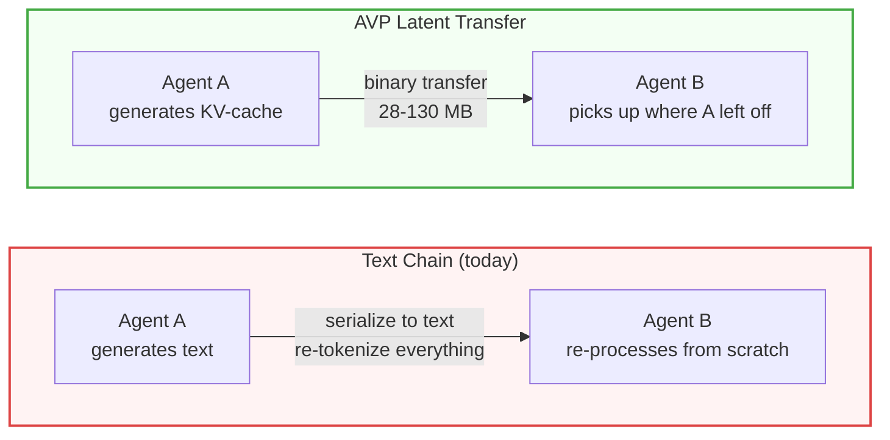

# Agent Vector Protocol (AVP)

[](tests/)
[](LICENSE)
[](https://python.org)
[](https://github.com/VectorArc/avp-spec)

**Transfer KV-cache between LLM agents instead of regenerating text. Same multi-agent pipeline, 73-78% fewer tokens, 2-4x faster.**

## How Text Chains Waste Compute



Every multi-agent framework today — LangChain, CrewAI, AutoGen, OpenAI Swarm — copies text between agents. Each agent re-tokenizes and re-processes everything prior agents already computed. Our benchmarks show **47-53% of all tokens in text chains are redundant re-processing**.

AVP eliminates this by transferring the KV-cache (the computed attention states) directly. The receiving agent reads prior reasoning from attention states instead of re-computing it from text.

## Key Results

| Metric | Value |
|--------|-------|
| Token savings vs text chains | **57-78%** across 4 benchmarks |
| Speed improvement | **2-4.3x** faster |
| HotpotQA: latent beats text AND direct | **35% EM / 0.54 F1** (vs 30% / 20%) |
| Models validated | Qwen2.5, DeepSeek-R1, Llama 3.2 |
| Tests | 260 passing (248 unit + 12 integration) |

Full results: **[docs/BENCHMARKS.md](docs/BENCHMARKS.md)**

## Quick Start

**Check compatibility between two models:**

```python
from avp import extract_model_identity, CompatibilityResolver

local = extract_model_identity(model_a)
remote = extract_model_identity(model_b)
session = CompatibilityResolver.resolve(local, remote)
# session.mode → LATENT (same model) or JSON (different)
```

**Latent communication pipeline:**

```python
from avp.connectors.huggingface import HuggingFaceConnector
import avp

connector = HuggingFaceConnector(model, tokenizer)

# Agent A: generate latent reasoning (no text output)
kv_cache = connector.generate_latent_steps(input_ids, num_steps=20)

# Encode for transfer
wire_bytes = avp.encode_kv_cache(kv_cache, metadata)

# Agent B: decode and continue generation with Agent A's context
restored_kv = avp.decode_kv_cache(wire_bytes)
output = model.generate(input_ids_b, past_key_values=restored_kv)
```

## How It Works

AVP defines a binary format, handshake, and codec — not the transport. It works alongside any agent protocol.

**Three communication modes, auto-negotiated via handshake:**

| Mode | When | What Happens |
|------|------|--------------|
| **Latent** | Same model | KV-cache + hidden state transfer, zero re-processing |
| **Cross-model** | Same family (e.g. Qwen2.5-1.5B ↔ 0.5B) | Vocabulary-mediated projection (Rosetta Stone v2), no training needed |
| **JSON fallback** | Incompatible models | Standard text, auto-negotiated |

**Transport-agnostic:** HTTP/2 (reference), gRPC, A2A, MCP, WebSockets, shared memory. AVP handles the latent communication layer — not discovery, routing, or orchestration.

## Features

**Protocol**
- Binary codec with 12-byte header + protobuf metadata
- KV-cache serialization (DynamicCache, tuple format)
- Session management with TTL and thread safety
- zstd compression

**Connectors**
- HuggingFace Transformers (full hidden state + KV-cache access)
- vLLM (KVConnectorBase_V1 plugin + SDK wrapper + PagedAttention conversion)

**Cross-Model (Rosetta Stone v2)**
- Vocabulary-mediated projection for same-family models
- Two-tier projection validation (cosine similarity + pseudo-perplexity)
- HYBRID mode (KV-cache + text summary fallback)

**Benchmarks**
- GSM8K 4-agent chain (3 model families)
- 2-agent handoff (most common real-world pattern)
- HotpotQA multi-hop QA (reading comprehension transfer)
- Fan-out aggregation (parallel specialists)

**Roadmap**
- CacheGen-style compression (3-4x wire size reduction)
- SGLang connector
- Larger model validation (7B+)

## Works With

- **[vLLM](https://github.com/vllm-project/vllm)** — KVConnectorBase_V1 plugin for production serving
- **[HuggingFace Transformers](https://github.com/huggingface/transformers)** — Full hidden state and KV-cache access
- **[A2A](https://github.com/google/A2A)** — Transport binding via `multipart/related` with binary payloads
- **[MCP](https://github.com/modelcontextprotocol)** — Complementary: MCP handles tools and context, AVP handles tensor transfer

## Benchmarks

| Benchmark | Latent Accuracy | Text Accuracy | Token Savings | Speed vs Text |
|-----------|----------------|---------------|---------------|---------------|
| GSM8K 4-agent (Llama 3.2-3B) | 70% | 65% | 74% | 2.1x |
| 2-agent handoff (Qwen 1.5B) | 55% | 55% | 57% | 2.0x |
| HotpotQA (Qwen 1.5B) | **35% EM** | 20% EM | 19% | 4.3x |
| Fan-out (Qwen 1.5B) | 30% | 60% | 62% | 2.2x |

HotpotQA is the standout: latent transfer preserves reading comprehension better than text summaries, beating both text chains and single-agent direct on exact match and F1.

Full methodology, per-hop analysis, cost projections, and raw data: **[docs/BENCHMARKS.md](docs/BENCHMARKS.md)**

## Install

```bash
# Core SDK (codec, handshake, session, fallback)
pip install avp

# With latent communication (realignment, KV-cache, HuggingFace connector)
pip install "avp[latent]"

# With HTTP/2 transport server
pip install "avp[server]"

# Everything including dev tools
pip install "avp[all]"
```

**From source:**

```bash
git clone https://github.com/VectorArc/avp-python.git
cd avp-python
pip install -e ".[all]"
```

## Documentation

- **[AVP Specification](https://github.com/VectorArc/avp-spec)** — Binary format, handshake, transport, security, test vectors
- **[Benchmark Results](docs/BENCHMARKS.md)** — Full results across 4 benchmarks and 3 model families
- **[Examples](examples/)** — Agent demo, mixed-model demo, quickstart
- **[Contributing](CONTRIBUTING.md)** — Dev setup, tests, code style

## Research Foundation

AVP builds on [LatentMAS: Latent Collaboration in Multi-Agent Systems](https://arxiv.org/abs/2511.20639) (Gen-Verse, 2025), which demonstrated same-model latent communication via hidden state transfer and KV-cache sharing. AVP productionizes this into a transport-agnostic binary protocol with cross-model support, compression, and engine connectors.

## License

Apache 2.0 — see [LICENSE](LICENSE)
