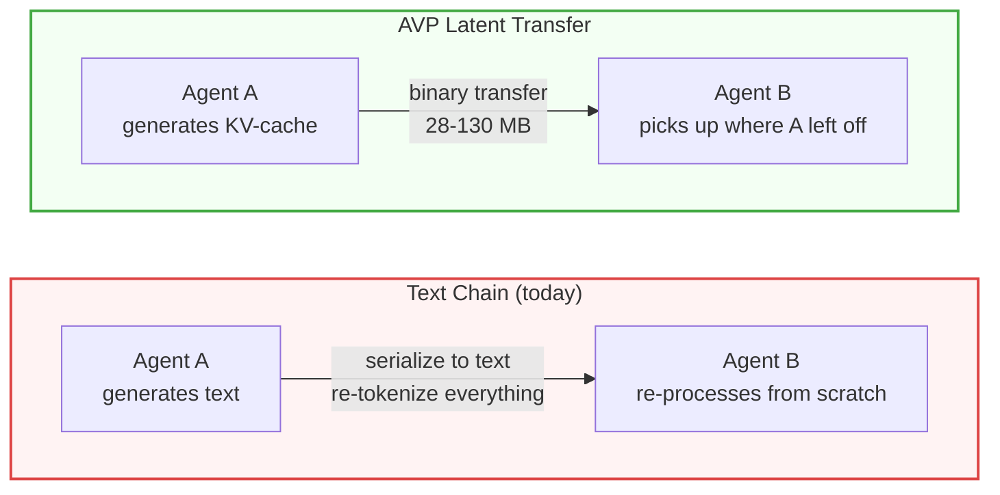

# Agent Vector Protocol (AVP) — KV-Cache Transfer for Multi-Agent LLMs

[](https://pypi.org/project/avp/)
[](https://github.com/VectorArc/avp-python/actions/workflows/ci.yml)
[](LICENSE)
[](https://python.org)
[](https://github.com/VectorArc/avp-spec)

**Multi-agent text handoffs discard KV-cache, embeddings, and attention state the previous agent already computed. AVP transfers that state directly — 51-78% fewer tokens, 1.5-5x faster, across models and families.**

```bash
pip install "avp[latent]"
```

## Who This Is For

> **Self-hosted models on GPUs.** AVP needs access to model internals (KV-cache, hidden states) that cloud APIs don't expose. If you use OpenAI, Anthropic, or Google APIs — AVP can't help you.

**Good fit:** Multi-agent pipelines on self-hosted models (vLLM, HuggingFace Transformers) with datacenter or same-machine connectivity.

**Not a fit:** Cloud API models, single-agent apps, edge/mobile, cross-internet links (<1 Gbps).

## Install

**Requires:** Python 3.9+, PyTorch >= 2.0. For vLLM integration: vLLM >= 0.15.

```bash
# Latent communication (HuggingFace connector, KV-cache transfer)
pip install "avp[latent]"

# With HTTP/2 transport server
pip install "avp[server]"

# Everything including dev tools
pip install "avp[all]"
```

## Quick Start

```python
from avp import HuggingFaceConnector

connector = HuggingFaceConnector.from_pretrained("Qwen/Qwen2.5-1.5B-Instruct")

prompt = "Analyze this math problem: 24 * 17 + 3"

# Agent A: latent reasoning (no text output, builds KV-cache)
context = connector.think(prompt, steps=20)

# Agent B: generate with Agent A's context (same prompt — KV-cache continues from it)
answer = connector.generate(prompt, context=context)
```

**Cross-model transfer (zero training):**

```python
from avp import HuggingFaceConnector

researcher = HuggingFaceConnector.from_pretrained("Qwen/Qwen2.5-7B-Instruct")
solver = HuggingFaceConnector.from_pretrained("meta-llama/Llama-3.2-3B-Instruct")

prompt = "Solve step by step: 24 * 17 + 3"
context = researcher.think(prompt, steps=20)
answer = solver.generate(prompt, context=context, source=researcher)
```

**Easy API (convenience wrappers with model caching):**

```python
import avp

# One-liner: think + generate
answer = avp.generate("Solve: 24 * 17 + 3", model="Qwen/Qwen2.5-1.5B-Instruct")

# Cross-model: think on larger model, generate on smaller
answer = avp.generate("Solve: 24 * 17 + 3", model="meta-llama/Llama-3.2-3B-Instruct",
                       source_model="Qwen/Qwen2.5-7B-Instruct")
```

**Cross-process transfer:**

```python
# Process A: serialize context
wire_bytes = context.to_bytes(session_id="s1", source_agent_id="agent-a")

# Process B: restore and generate
from avp import AVPContext, HuggingFaceConnector
connector = HuggingFaceConnector.from_pretrained("Qwen/Qwen2.5-1.5B-Instruct")
restored = AVPContext.from_bytes(wire_bytes, device="cuda")
answer = connector.generate(prompt, context=restored)
```

## Key Results

| Metric | Value |
|--------|-------|
| Token savings vs text chains | **51-78%** across 7 benchmarks, 5 models |
| Speed improvement | **1.5-5x** faster (model and task dependent) |
| HumanEval (code gen) | Latent **64%** vs text **42%** (p=0.029) — text multi-agent hurts code gen |
| Cross-model (zero training) | **72%** GSM8K accuracy, Qwen 7B to Llama 3B, **6 KB** wire |
| Models validated | Qwen2.5 (1.5B, 7B), DeepSeek-R1 (1.5B), Llama 3.2 (1B, 3B) |
| Hardware | A100 (cloud), RTX 3070 Ti (local) |

> **Same-model:** Latent matches direct accuracy on math (GSM8K 85%) and beats text significantly on code generation (HumanEval 64% vs 42%, p=0.029). **Cross-model:** Zero-training vocabulary projection achieves 72% on structured tasks (GSM8K) with 6 KB wire. See [full results](docs/BENCHMARKS.md).

## How It Works



Every multi-agent framework today — LangChain, CrewAI, AutoGen, OpenAI Swarm — copies text between agents. Each agent re-tokenizes and re-processes everything prior agents already computed. Our benchmarks show **47-53% of all tokens in text chains are redundant re-processing**. (See [Works With](#works-with) for integration examples.)

AVP eliminates this by transferring the KV-cache (the computed attention states) directly. The receiving agent reads prior reasoning from attention states instead of re-computing it from text.

**Transfer size:** 28-130 MB per turn depending on model and sequence length. This is per handoff, not cumulative — each agent's context replaces the previous one.

**VRAM overhead:** Zero additional VRAM. `AVPContext` holds references to the KV-cache already in GPU memory. No copies.

AVP defines a binary format, handshake, and codec — not the transport. It works alongside any agent framework or protocol.

```
┌──────────────────────────────────────────────────────────────┐
│  Your Orchestrator (LangGraph / CrewAI / PydanticAI / any)    │
│                                                              │
│  Agent A                          Agent B                    │
│    │                                ▲                        │
│    │  connector.think() ──►         │  connector.generate()  │
│    │  AVPContext                     │  with context=...      │
│    │                                │                        │
│    │    context.to_bytes()          │  AVPContext.from_bytes()│
│    ▼                                │                        │
│  ┌────────────────────────────────────────────┐              │
│  │  AVP (this library)                        │              │
│  │  • Handshake — resolves LATENT/JSON mode   │              │
│  │  • Codec — serialize/deserialize KV-cache  │              │
│  │  • Session — TTL, thread safety            │              │
│  └────────────────────────────────────────────┘              │
│         │                                                    │
│    Transport: HTTP/2, gRPC, shared memory, file, any         │
└──────────────────────────────────────────────────────────────┘
```

**Three communication modes, auto-negotiated via handshake:**

| Mode | When | What Happens |
|------|------|--------------|
| **Latent** | Same model | KV-cache + hidden state transfer, zero re-processing |
| **Cross-model** | Same or different family (e.g. Qwen 7B to Llama 3B) | Vocabulary-mediated projection, zero training needed |
| **JSON fallback** | No compatible projection path | Standard text, auto-negotiated |

**Cross-model calibration** is one-time per model pair (~0.5-2s), cached to `~/.avp/maps/`. Subsequent calls are instant.

**Transport-agnostic:** HTTP/2 (reference), gRPC, A2A, MCP, WebSockets, shared memory. AVP handles the latent communication layer — not discovery, routing, or orchestration.

## When Does AVP Win?

| Sequence Length | Re-compute (A100) | AVP Transfer (10 Gbps) | Winner |
|----------------|-------------------|----------------------|--------|
| 500 tokens | ~50 ms | ~25 ms (28 MB) | AVP |
| 2,000 tokens | ~200 ms | ~50 ms (55 MB) | AVP |
| 8,000 tokens | ~800 ms | ~130 ms (130 MB) | AVP |

Re-computation scales quadratically with attention; transfer scales linearly with KV-cache size. AVP wins for sequences above ~300 tokens on datacenter interconnects.

## Production: vLLM Integration

vLLM can't expose per-step hidden states, so latent transfer happens at the engine level via a KV connector plugin. This requires launching vLLM with a custom connector module:

```bash
# Launch vLLM with AVP KV connector
vllm serve Qwen/Qwen2.5-7B-Instruct \
    --kv-connector AVPKVConnectorV1Dynamic \
    --kv-connector-module-path avp.connectors.vllm_kv_connector
```

```python
# Application code uses VLLMConnector — KV transfer happens behind the scenes
from avp import VLLMConnector

connector = VLLMConnector(model_id="Qwen/Qwen2.5-7B-Instruct")
answer = connector.generate("Analyze and solve: 24 * 17 + 3")
```

The `AVPKVConnectorV1Dynamic` plugin saves/loads KV-cache between vLLM instances via a file-based store, so agents on the same machine share computed attention states without re-processing.

## API Reference

### Easy API

| Import | What It Does |
|--------|-------------|
| `think(prompt, *, model=, steps=20)` | Run latent thinking steps. Returns `AVPContext`. |
| `generate(prompt, *, model=, steps=20, context=, source_model=)` | Think + generate in one call. Returns text. |
| `ContextStore` | Thread-safe `AVPContext` store with TTL for multi-turn sessions. |

### Connector API

| Import | What It Does |
|--------|-------------|
| `HuggingFaceConnector` | Main connector. `think()` builds KV-cache (returns `AVPContext`), `generate()` produces text. `from_pretrained()` for easy setup. |
| `VLLMConnector` | Production connector. `generate()` returns text. Latent transfer happens at engine level via KV connector plugin. |
| `AVPContext` | Wraps KV-cache + model metadata. Pass between `think()` and `generate()`, or serialize with `to_bytes()` / `from_bytes()` for cross-process transfer. |

### Protocol Layer

| Import | What It Does |
|--------|-------------|
| `encode` / `decode` | Binary codec for hidden states, KV-cache, and hybrid payloads. |
| `extract_model_identity` | Extract `ModelIdentity` (family, dimensions, hash) from a HuggingFace model. |
| `CompatibilityResolver.resolve()` | Handshake: compares two `ModelIdentity` objects, returns LATENT, HYBRID, or JSON mode. |
| `SessionManager` | Manage communication sessions with TTL and thread safety. |
| `AVPClient` / `AVPAsyncClient` | HTTP/2 client (sync and async) for sending AVP messages over the network. |
| `create_app` | Create a FastAPI server that receives AVP messages. |

### Cross-Model (Rosetta Stone)

| Import | What It Does |
|--------|-------------|
| `calibrate` | Build a projection map (`AVPMap`) between two models for cross-model transfer. Auto-detects same-family (vocab mediated) vs cross-family (vocab overlap). |
| `vocabulary_mediated_projection` | Project hidden states via shared vocabulary (same tokenizer). |
| `vocab_overlap_projection` | Project hidden states via overlapping BPE tokens (different tokenizers). |
| `validate_projection` | Quality gate: cosine similarity (fast) + pseudo-perplexity (thorough). Returns LATENT/HYBRID/JSON recommendation. |
| `save_map` / `load_map` / `find_map` | Persist and retrieve `.avp-map` files for reuse. |

### Error Types

All errors inherit from `AVPError`. Key types: `IncompatibleModelsError`, `HandshakeError`, `DecodeError`, `ShapeMismatchError`, `RealignmentError`, `SessionExpiredError`, `EngineNotAvailableError`, `FallbackRequested`.

## Roadmap

- Bidirectional latent communication (A→B + B→A latent, not just one-way)
- vLLM serving throughput benchmarks
- CacheGen-style compression (3-4x KV-cache wire size reduction)

## Works With

### Agent Frameworks

AVP works *with* your orchestration framework, not instead of it. Replace `llm.invoke()` with `avp.generate()` — your framework sees text in, text out. The KV-cache lives in a `ContextStore` on the GPU side; the framework's state carries only strings.

```python
import avp

MODEL = "Qwen/Qwen2.5-7B-Instruct"
store = avp.ContextStore(default_ttl=300)

# Before: result = llm.invoke("Research: " + query)
# After:
def researcher(state):
    return avp.generate(
        "Research: " + state["query"],
        model=MODEL, store=store, store_key="researcher",
    )

def solver(state):
    return avp.generate(
        "Solve: " + state["query"],
        model=MODEL, store=store, prior_key="researcher",
    )
```

The solver automatically receives the researcher's KV-cache via the store. The framework never touches tensors — it checkpoints text to its database as usual.

See **[Framework Integration Guide](docs/FRAMEWORK_INTEGRATION.md)** for LangGraph, CrewAI, and cross-model examples.

| Framework | Integration Point |
|-----------|-------------------|
| **LangGraph** | Graph node function — `avp.generate()` replaces LLM call |
| **CrewAI** | `BaseLLM.call()` override or lambda wrapper |
| **PydanticAI** | `FunctionModel` callback |
| **LlamaIndex** | `CustomLLM.complete()` override |
| **OpenAI Agents SDK** | `Model.get_response()` override |
| **Google ADK** | `BaseLlm.generate_content_async()` override |

### Infrastructure & Protocols

- **[vLLM](https://github.com/vllm-project/vllm)** — KVConnectorBase_V1 plugin for production serving
- **[HuggingFace Transformers](https://github.com/huggingface/transformers)** — Full hidden state and KV-cache access
- **[A2A](https://github.com/google/A2A)** — Transport binding via `multipart/related` with binary payloads
- **[MCP](https://github.com/modelcontextprotocol)** — Complementary: MCP handles tools and context, AVP handles tensor transfer

## Key Concepts

| Term | What It Means |
|------|---------------|
| **KV-cache** | During text generation, each transformer layer computes key and value vectors for the attention mechanism. These are cached so they don't need to be recomputed for each new token. AVP transfers this cache between agents so the receiving agent doesn't recompute what the sender already processed. |
| **Hidden states** | The internal vector representations at each transformer layer — the model's "understanding" of the input at that point in the network. Richer than text because they carry information that gets lost when converting to tokens. |
| **Latent transfer** | Sending KV-cache or hidden states (the "latent" internal representations) instead of converting to text and back. Avoids the lossy text bottleneck. |
| **Realignment** | Normalizing hidden states before injecting them into another model instance, so they match the expected input distribution. Required because hidden state magnitudes can drift. |
| **Tied weights** | When a model reuses the same weight matrix for both input embeddings and output projection (common in smaller models like Qwen <=3B, Llama 3.2 <=3B). Requires a special softmax-based projection instead of simple normalization. |
| **Vocabulary-mediated projection** | Cross-model transfer technique: convert source hidden states to token probabilities using the source model's output head, then reconstruct target-compatible representations using the target model's input embeddings. Works across families — when tokenizers differ, AVP projects through overlapping vocabulary tokens (~85% overlap for Qwen/Llama). |
| **PagedAttention** | vLLM's memory management for KV-cache — stores cache in non-contiguous pages. AVP's `page_convert` module handles conversion between paged and contiguous formats. |

## Documentation

- **[AVP Specification](https://github.com/VectorArc/avp-spec)** — Binary format, handshake, transport, security, test vectors
- **[Framework Integration](docs/FRAMEWORK_INTEGRATION.md)** — LangGraph, CrewAI, cross-model examples, ContextStore as sidecar
- **[Benchmark Results](docs/BENCHMARKS.md)** — Full results: 7 benchmarks, 5 models, same-model + cross-model
- **[Examples](examples/)** — Quickstart, agent demo, think/generate demo
- **[Contributing](CONTRIBUTING.md)** — Dev setup, tests, code style

## Research Foundation

AVP builds on [LatentMAS: Latent Collaboration in Multi-Agent Systems](https://arxiv.org/abs/2511.20639) (Gen-Verse, 2025), which demonstrated same-model latent communication via hidden state transfer and KV-cache sharing. AVP productionizes this into a transport-agnostic binary protocol with cross-model support, compression, and engine connectors.

## License

Apache 2.0 — see [LICENSE](LICENSE)
