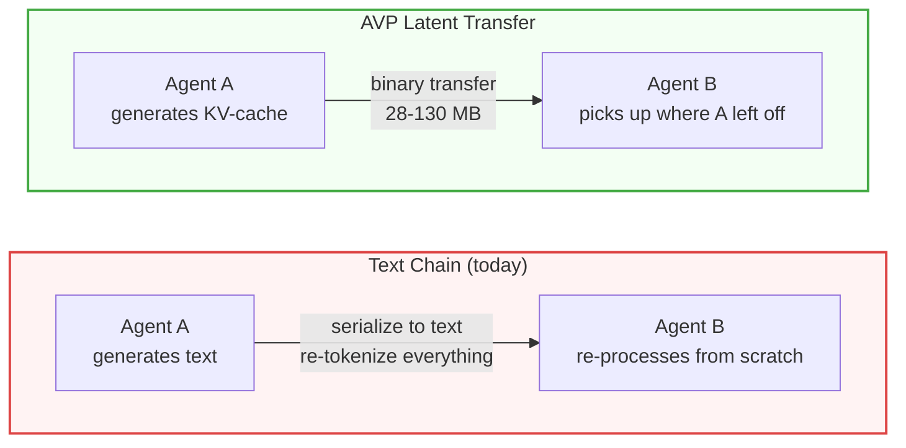

# Agent Vector Protocol (AVP) — KV-Cache Transfer for Multi-Agent LLMs

[](https://pypi.org/project/avp/)
[](https://github.com/VectorArc/avp-python/actions/workflows/ci.yml)
[](LICENSE)
[](https://python.org)
[](https://github.com/VectorArc/avp-spec)

**Multi-agent text handoffs discard KV-cache and attention state. AVP transfers that state directly — 46-78% fewer tokens, 2-4x faster, across models and families.** Built on [LatentMAS](https://arxiv.org/abs/2511.20639) (2025).

```bash
pip install "avp[latent]"
```

> **Self-hosted models on GPUs only.** AVP needs access to model internals (KV-cache, hidden states) that cloud APIs don't expose. If you use OpenAI, Anthropic, or Google APIs — AVP can't help you. Good fit: multi-agent pipelines on vLLM or HuggingFace Transformers with datacenter or same-machine connectivity.

## Quick Start

```python
from avp import HuggingFaceConnector

connector = HuggingFaceConnector.from_pretrained("Qwen/Qwen2.5-7B-Instruct")
prompt = "Analyze this math problem: 24 * 17 + 3"

# Agent A: latent reasoning (no text output, builds KV-cache)
context = connector.think(prompt, steps=10)

# Agent B: generate with Agent A's context
answer = connector.generate(prompt, context=context)
```

## Results

| | Direct | Latent (AVP) | Text |
|---|--------|--------------|------|
| **HumanEval** (Qwen 7B, n=164) | 58.5% | **67.1%** | 53.0% |
| **GSM8K** (Qwen 7B, n=200) | 91.0% | **90.5%** | 87.0% |
| **DebugBench** (Qwen 7B, n=100) | 50.0% | **51.0%** | 49.0% |
| **GSM8K** (Llama 3B, n=200) | 75.0% | **78.0%** | 75.5% |

+8.6pp on code generation (p=0.029). 46-78% fewer tokens. 2-4x faster. Tested on NVIDIA A100.

**Cross-model (zero training, 6 KB wire):**

| Source → Target | GSM8K | HumanEval |
|-----------------|-------|-----------|
| Qwen 7B → Llama 3B | 74.5% | 47.0% |
| Llama 3B → Qwen 7B | **90.0%** | **79.3%** |

Full results: **[Benchmarks](docs/BENCHMARKS.md)** — 8 benchmarks, 5 models, 2 families.

## How It Works



AVP transfers the KV-cache (computed attention states) directly between agents. The receiving agent reads prior reasoning from attention states instead of re-computing it from text. Three modes, auto-negotiated:

| Mode | When | What Happens |
|------|------|--------------|
| **Latent** | Same model | KV-cache transfer, zero re-processing |
| **Cross-model** | Same or different family | Vocabulary-mediated projection, zero training |
| **JSON fallback** | No compatible path | Standard text, auto-negotiated |

<details>
<summary><strong>Cross-model transfer</strong></summary>

```python
from avp import HuggingFaceConnector

researcher = HuggingFaceConnector.from_pretrained("Qwen/Qwen2.5-7B-Instruct")
solver = HuggingFaceConnector.from_pretrained("meta-llama/Llama-3.2-3B-Instruct")

prompt = "Solve step by step: 24 * 17 + 3"
context = researcher.think(prompt, steps=10)
answer = solver.generate(prompt, context=context, source=researcher)
```

Cross-model calibration is one-time per model pair (~0.5-2s), cached to `~/.avp/maps/`.

</details>

<details>
<summary><strong>Easy API (convenience wrappers)</strong></summary>

```python
import avp

# One-liner: think + generate
answer = avp.generate("Solve: 24 * 17 + 3", model="Qwen/Qwen2.5-7B-Instruct")

# Cross-model
answer = avp.generate("Solve: 24 * 17 + 3",
                       model="meta-llama/Llama-3.2-3B-Instruct",
                       source_model="Qwen/Qwen2.5-7B-Instruct")
```

</details>

<details>
<summary><strong>vLLM integration</strong></summary>

Latent transfer at the engine level via KV connector plugin:

```bash
vllm serve Qwen/Qwen2.5-7B-Instruct \
    --kv-connector AVPKVConnectorV1Dynamic \
    --kv-connector-module-path avp.connectors.vllm_kv_connector
```

```python
from avp import VLLMConnector

connector = VLLMConnector(model_id="Qwen/Qwen2.5-7B-Instruct")
answer = connector.generate("Analyze and solve: 24 * 17 + 3")
```

The plugin saves/loads KV-cache between vLLM instances via file-based store.

</details>

<details>
<summary><strong>Cross-process transfer</strong></summary>

```python
# Process A: serialize context
wire_bytes = context.to_bytes(session_id="s1", source_agent_id="agent-a")

# Process B: restore and generate
from avp import AVPContext, HuggingFaceConnector
connector = HuggingFaceConnector.from_pretrained("Qwen/Qwen2.5-7B-Instruct")
restored = AVPContext.from_bytes(wire_bytes, device="cuda")
answer = connector.generate(prompt, context=restored)
```

</details>

## Works With

AVP works *with* your orchestration framework, not instead of it. Replace `llm.invoke()` with `avp.generate()` — your framework sees text in, text out.

| Framework | Integration |
|-----------|-------------|
| **LangGraph** | Graph node — `avp.generate()` replaces LLM call |
| **CrewAI** | `BaseLLM.call()` override |
| **PydanticAI** | `FunctionModel` callback |
| **LlamaIndex** | `CustomLLM.complete()` override |
| **vLLM** | KVConnectorBase_V1 plugin |
| **HuggingFace** | Full hidden state and KV-cache access |
| **A2A / MCP** | Complementary — AVP handles tensor transfer |

See **[Framework Integration Guide](docs/FRAMEWORK_INTEGRATION.md)** for examples.

## Roadmap

- Bidirectional latent communication (A→B + B→A latent)
- vLLM serving throughput benchmarks
- CacheGen-style compression (3-4x KV-cache size reduction)

## Documentation

- **[AVP Specification](https://github.com/VectorArc/avp-spec)** — Binary format, handshake, transport
- **[Benchmarks](docs/BENCHMARKS.md)** — 8 benchmarks, 5 models, 2 families
- **[Framework Integration](docs/FRAMEWORK_INTEGRATION.md)** — LangGraph, CrewAI, cross-model examples
- **[Examples](examples/)** — Quickstart and agent demos

## License

Apache 2.0 — see [LICENSE](LICENSE)
